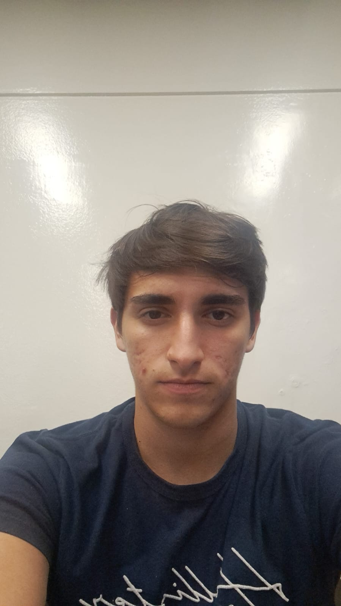
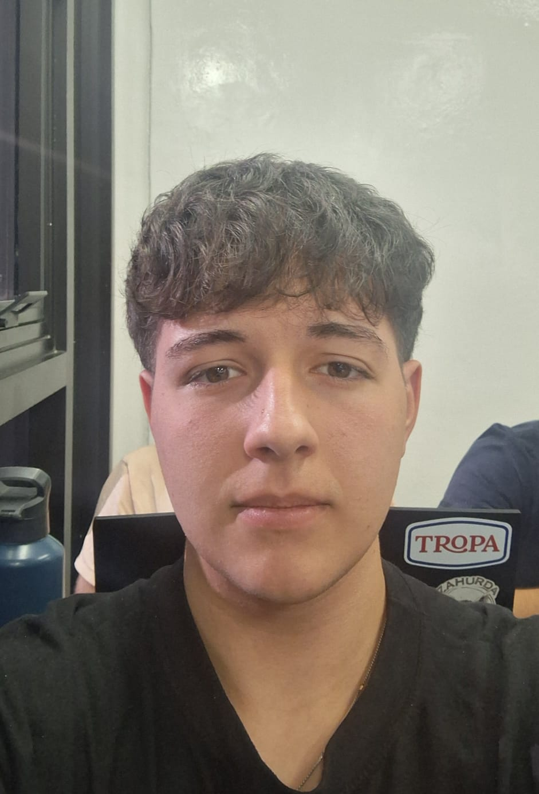

# 🚀 Proyecto de Programación 2

Este repositorio contiene las actividades y trabajos prácticos desarrollados para la materia **Programación 2** de la Universidad Argentina de la Empresa (UADE).

## 👥 Integrantes del Grupo

<table align="center">
  <tr>
    <td align="center">
       
      <b>Agustín Suárez</b> 
      Legajo: 1220883 
      
    </td>
    <td align="center">
       
      <b>Octavio Pena</b> 
      Legajo: 1218569 
      
    </td>
    <td align="center">
       
      <b>Santiago Palma</b> 
      Legajo: 1220491 
      
    </td>
  </tr>
  <tr>
    <td align="center">
       
      <b>Bautista Echarri</b> 
      Legajo: 1220111 
      
    </td>
    <td align="center">
       
      <b>Manuel Bonfiglio</b> 
      Legajo: 1221522 
      
    </td>
    <!-- Celda invisible para que la tabla no se rompa -->
    <td></td> 
  </tr>
</table>
